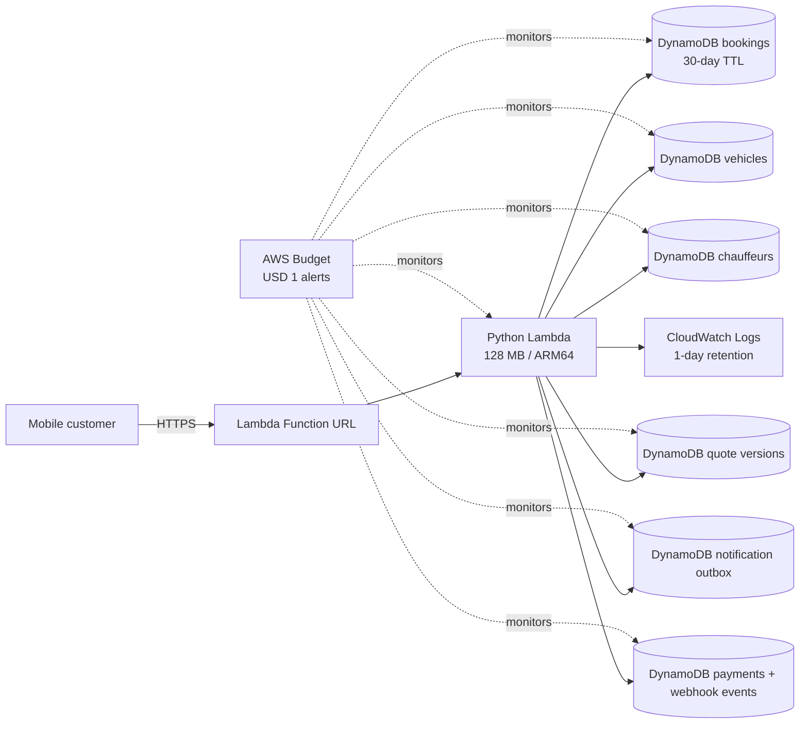
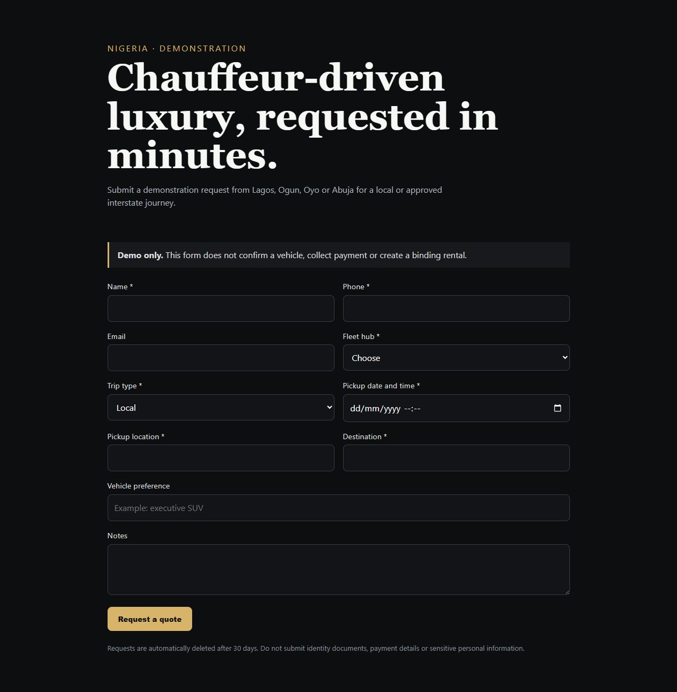
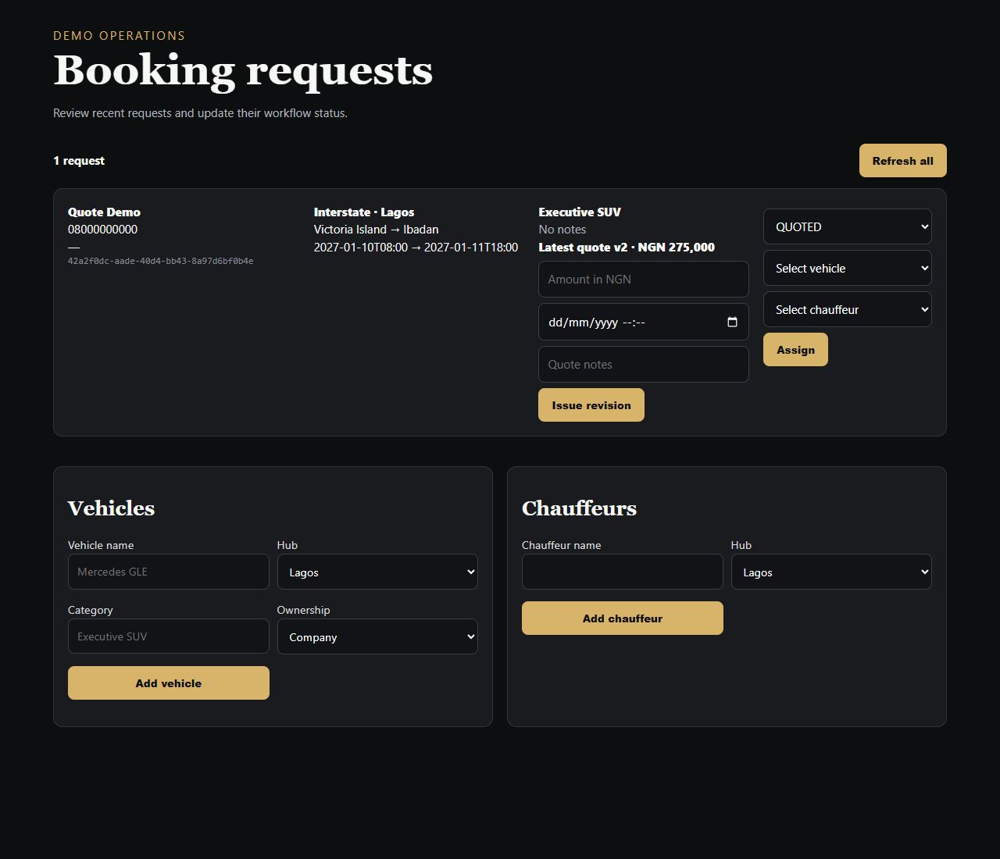

# Car Mobility Platform

[](https://github.com/ababisoye/car-mobility-platform/actions/workflows/terraform-validate.yml)

A cloud-native booking platform for chauffeur-driven luxury vehicles in Nigeria. The project demonstrates how business requirements become secure, cost-conscious AWS infrastructure using Python, Terraform, DynamoDB, Lambda and GitHub Actions.

The initial operating hubs are Lagos, Ogun, Oyo and Abuja, with local and approved interstate journeys. Self-drive rental is intentionally excluded.

## Engineering outcomes

- Designed a serverless demonstration that has no always-running compute
- Reduced the public request path to Lambda Function URL and DynamoDB
- Implemented infrastructure as code for demo, non-production and production stages
- Added booking validation, short-lived demo records and security headers
- Added a password-protected operations view for booking review and status updates
- Added vehicle and chauffeur availability management across all four hubs
- Added atomic booking assignment that reserves a vehicle and chauffeur together
- Rejects unavailable, wrong-hub and overlapping resource assignments
- Atomically releases assigned fleet resources when trips complete or bookings terminate
- Preserves immutable quote revisions and exposes only the latest customer quote
- Lets token-authenticated customers accept or decline only the latest unexpired quote
- Queues booking, quote and assignment events in a provider-neutral notification outbox
- Creates payment requests from approved quotes and verifies signed, idempotent payment webhooks
- Promotes immutable Lambda versions through a stable alias with a manual, OIDC-based rollback workflow
- Emits privacy-conscious JSON logs with request correlation, latency and Lambda release metadata
- Versions every DynamoDB record and provides an account-guarded, dry-run-first migration workflow
- Separates administrator and operator permissions with matching server-side and dashboard controls
- Protects customer booking, quote and payment lookups with one-time access tokens stored only as hashes
- Provides a customer self-service panel for booking, quotation and payment status
- Publishes a versioned OpenAPI 3.1 contract with automated route and security checks
- Automated Python tests plus Terraform formatting and validation in CI
- Documented a production growth path without forcing production cost on the MVP

## Architecture



The zero-funding path deliberately omits API Gateway, a load balancer, NAT Gateway, containers and RDS. The reusable production foundation remains available for a later, funded phase.

Assignment uses a DynamoDB transaction to change the booking, vehicle and chauffeur together. A concurrent request fails instead of partially assigning or double-reserving a resource.

## Booking interface





Run the interface locally without AWS credentials:

```powershell
python scripts/preview-demo.py
```

Then open `http://127.0.0.1:8080`. Local preview bookings are held in memory and disappear when the process stops.

The local operations dashboard is at `http://127.0.0.1:8080/admin`; its preview-only password is printed by the script.

## Zero-funding mode

The recommended starting point is `infra/environments/demo`. It replaces all always-running infrastructure with:

- One Python Lambda function with 128 MB memory and concurrency capped at one
- One Lambda Function URL, with no load balancer or API Gateway
- Six DynamoDB tables for bookings, vehicles, chauffeurs, quote versions, notifications and payment events, each using 1 provisioned read and 1 provisioned write unit
- One-day CloudWatch log retention
- Automatic deletion of booking requests after 30 days
- A USD 1 actual and forecast budget notification

The function serves the mobile booking form and its small API from one deployment. It is a demonstration, not a production rental platform. It records simulated payment state but deliberately does not collect card details, transfer money or collect identity documents.

The machine-readable API contract is stored at `infra/environments/demo/app/openapi.json` and served by the demo at `GET /openapi.json`. Tests verify that every routed operation is documented and that customer, staff and webhook endpoints declare their expected header security scheme.

AWS Budgets only sends alerts; it is not a hard spending cap. A new AWS Free account plan prevents charges while the plan is active, but it ends after six months or when credits are exhausted. Keep a local export of anything important.

## Current scope

- Separate non-production and production roots
- Versioned, encrypted S3 remote state with native S3 locking
- Two-Availability-Zone VPC
- Public, private application and isolated database subnets
- Cost-aware single or per-AZ NAT gateway configuration
- Private, versioned document storage with TLS-only access
- Encrypted Amazon RDS for PostgreSQL
- AWS Budgets alerts and Cost Anomaly Detection
- GitHub Actions formatting and validation workflow

Application compute, CloudFront, Cognito, queues and deployment roles are intentionally the next layer. This first layer establishes the network, data and cost-control foundation they require.

## Prerequisites

- Terraform 1.15.9
- AWS CLI v2
- An AWS account with MFA-protected administrative access
- Africa (Cape Town), `af-south-1`, enabled if selected
- A unique state bucket name
- A verified billing-alert email address

Do not use root-user credentials or long-lived AWS access keys.

## Repository structure

```text
infra/
  bootstrap/              Remote-state bucket, created once
  modules/
    network/              VPC, subnets, routing and application security group
    storage/              Private customer/vehicle document bucket
    database/             PostgreSQL and its security group
    cost-controls/        Budget and anomaly notifications
  stacks/foundation/      Composes the reusable modules
  environments/
    demo/                 Zero-funding serverless booking demonstration
    nonprod/              Reduced-cost integration/staging foundation
    production/           Production safety defaults
  github-release-role/    Least-privilege GitHub OIDC role for Lambda releases
docs/
  release-runbook.md      Manual promotion, rollback and emergency checks
  observability-runbook.md Structured-log queries and incident response
  data-migrations.md      DynamoDB compatibility, verification and rollback rules
  access-control.md       Demo role matrix and managed-identity boundary
  customer-access.md      Hashed booking-token handling and customer API rules
scripts/
  generate-admin-password-hash.py  Create the demo dashboard credential hash
  preview-demo.py         Local preview with in-memory booking storage
  terraform-check.ps1     Local formatting and validation helper
  migrate-demo-schema.py  Conditional, idempotent schema-version migration
```

## 1. Bootstrap remote state

Skip this section for the zero-funding demo. The demo uses local state to avoid creating an additional cloud resource.

Copy `infra/bootstrap/terraform.tfvars.example` to `terraform.tfvars`, choose a globally unique bucket name, authenticate with temporary AWS credentials, then run:

```powershell
Set-Location infra/bootstrap
terraform init
terraform plan -out bootstrap.tfplan
terraform apply bootstrap.tfplan
```

The bootstrap state starts locally because the remote bucket does not exist yet. Store that small local state securely, then migrate it deliberately if required.

## 2. Configure an environment

For non-production, copy both examples:

```powershell
Copy-Item infra/environments/nonprod/backend.hcl.example infra/environments/nonprod/backend.hcl
Copy-Item infra/environments/nonprod/terraform.tfvars.example infra/environments/nonprod/terraform.tfvars
```

Fill in the state bucket, AWS account ID and billing email. Then:

```powershell
Set-Location infra/environments/nonprod
terraform init -backend-config=backend.hcl
terraform validate
terraform plan -out nonprod.tfplan
```

Review the plan and projected cost before any apply. Repeat with `production` only after non-production tests pass.

## Zero-funding demo deployment

Copy the example variables and replace the placeholders:

```powershell
Copy-Item infra/environments/demo/terraform.tfvars.example infra/environments/demo/terraform.tfvars
python scripts/generate-admin-password-hash.py
./scripts/build-demo-package.ps1
Set-Location infra/environments/demo
terraform init
terraform plan -out demo.tfplan
```

Review the plan carefully. It should contain no VPC, NAT Gateway, load balancer, ECS service or RDS database. Apply only while using the AWS Free plan or after accepting the small pay-as-you-go risk:

```powershell
terraform apply demo.tfplan
terraform output -raw demo_url
```

Paste the generated hash into `admin_password_hash` in the ignored `terraform.tfvars` file. Run the helper again with a distinct operator password and place that hash in `operator_password_hash`, or leave the operator value empty to disable that role. Plaintext passwords are never written by the helper. After deployment, append `/admin` to the demo URL to open the operations dashboard.

Set `payment_webhook_secret` to a separate random value of at least 32 characters. A payment provider adapter must sign the exact webhook request body with HMAC-SHA256 and send the hexadecimal digest in `x-webhook-signature`; never reuse the admin password or commit a real secret.

The dashboard authentication is deliberately small and cost-free: HTTPS carries a staff password and Lambda verifies it against a salted PBKDF2 hash. Administrators control fleet records; operators can run booking, quote, payment, assignment and notification workflows but cannot change fleet availability. See the [access-control model](docs/access-control.md). For production, replace shared role credentials with individual managed identities, MFA and durable user-level audit history.

Notification events are stored but not sent in zero-funding mode. A later provider adapter can deliver them by email, SMS or WhatsApp without coupling booking logic to one vendor.

Payment requests are also provider-neutral. A customer must first accept the latest quote with their one-time booking token; staff can then create a payment request at `POST /admin/bookings/{booking_id}/payments`. Customers can check `GET /bookings/{booking_id}/payment`, and a future provider posts signed status events to `POST /webhooks/payments`. Webhook event IDs are retained for 30 days so retries do not apply the same event twice. See [quote decisions](docs/quote-decisions.md).

Customer status, quote and payment endpoints require `x-booking-token`. Only a SHA-256 hash is stored, invalid credentials receive the same response as unknown bookings, and staff APIs never return the hash. See [customer booking access](docs/customer-access.md).

Unpaid customers can cancel online before a trip starts. Cancellation and staff completion release an assigned vehicle and chauffeur in the same DynamoDB transaction as the booking update, making those resources safely available for another trip. Paid cancellations require operations review because refunds are provider-dependent. See [booking lifecycle](docs/booking-lifecycle.md).

Destroy the demo when it is no longer needed:

```powershell
terraform destroy
```

## Required decisions before deployment

- Confirm `af-south-1` or replace it after the documented latency comparison.
- Confirm the AWS account IDs.
- Approve the monthly budget thresholds.
- Confirm whether production starts with Single-AZ or Multi-AZ RDS.
- Confirm whether one or two NAT gateways are approved.
- Agree the database name and retention requirements.

## Security notes

- The RDS instance has no public endpoint.
- The document bucket blocks all public access and denies non-TLS requests.
- Database credentials are generated and managed by RDS in Secrets Manager.
- Terraform state is sensitive; restrict read access as tightly as write access.
- Production deletion protection is enabled in the example variables.

## Validation

Run:

```powershell
./scripts/terraform-check.ps1
```

The helper requires Terraform to be installed. GitHub Actions performs the same formatting and validation checks on pushes and pull requests.

The Lambda tests can also be run independently:

```powershell
python -m unittest discover -s tests -v
```

## Controlled releases

The `Controlled demo release` workflow is manual and dormant until its protected GitHub environment and AWS OIDC role are configured. It validates and packages a selected Git revision before requesting short-lived AWS credentials, then promotes an immutable Lambda version through the `live` alias. See the [release and rollback runbook](docs/release-runbook.md).

Creating or committing this workflow does not deploy infrastructure and does not create AWS charges. Running its deployment operation requires an existing demo stack and explicit GitHub environment approval.

The Lambda emits structured JSON without request bodies, credentials or customer contact fields. Every response includes `x-request-id`, and `/health` identifies the active Lambda version. See the [observability and incident runbook](docs/observability-runbook.md) for safe CloudWatch queries and response steps.

The demo also enforces exact route shapes, canonical UUIDs, a 16 KB request limit, contact-field validation and bounded trip dates. These application checks remain free, but they do not replace production-grade edge throttling or bot protection. See [API hardening](docs/api-hardening.md).

All DynamoDB records carry an explicit schema version. The [data migration guide](docs/data-migrations.md) defines additive compatibility, dry-run review, account verification, conditional writes and rollback expectations. The migration helper is never invoked automatically by CI or deployment.

## Skills demonstrated

AWS serverless architecture, Terraform module design, IAM least privilege, application RBAC, DynamoDB data lifecycle and schema migration, Lambda packaging, structured observability, controlled rollback, cost controls, Python testing, GitHub Actions CI and environment separation.

## Roadmap

- Real payment-provider and notification delivery adapters
- Managed production identity with MFA and durable user-level audit history
