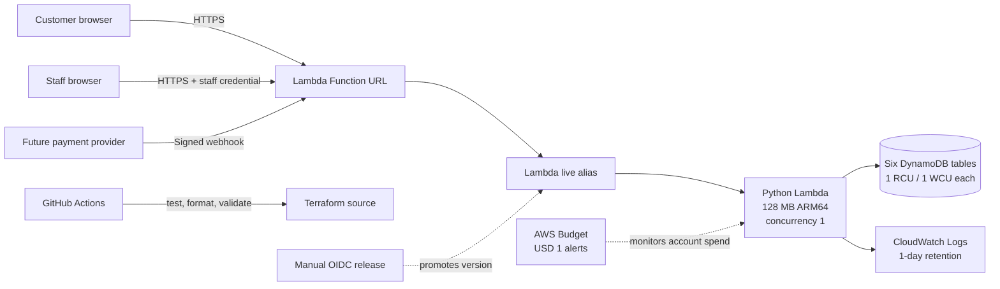
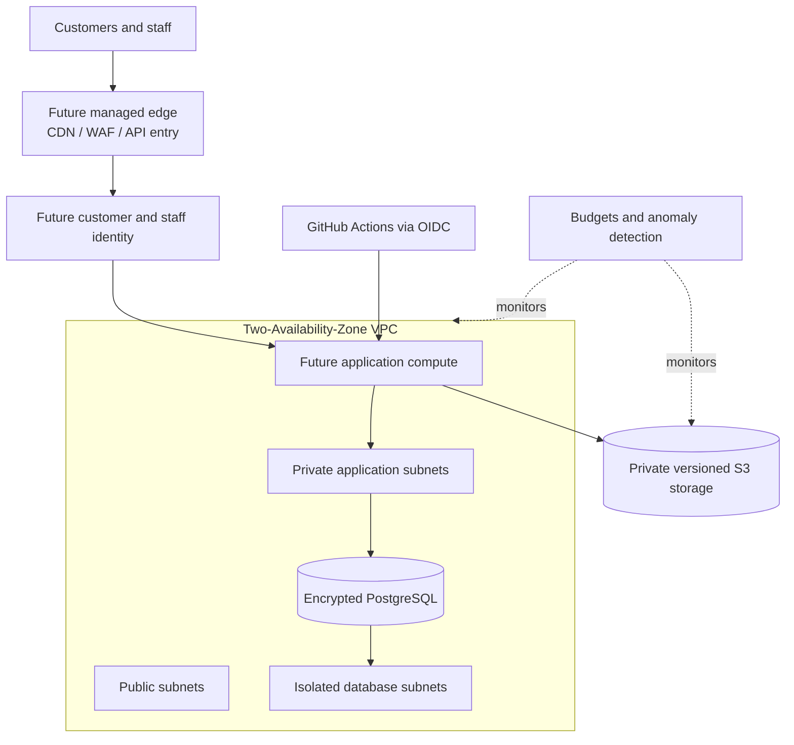

# Architecture decisions

This project separates a runnable, cost-constrained demonstration from a production-ready growth path. The separation is deliberate: the demo proves booking workflows and cloud engineering controls without pretending that a public prototype has production availability or identity assurance.

## Decision 1: use a serverless demo path

The Lambda Function URL is the only public ingress. Lambda serves the HTML interface and API, keeping the demonstration to one compute unit. DynamoDB transactions protect multi-record booking, fleet, quote, payment and notification changes from partial writes.

### Why there is no NAT Gateway

The demo Lambda is not attached to a VPC and does not need private-subnet internet egress. A NAT Gateway would add an always-on hourly and data-processing charge without improving this design. The later production foundation can place workloads in private application subnets and enable controlled egress when a real integration requires it.

### Why there is no load balancer or API Gateway

A Lambda Function URL already provides HTTPS ingress for the demonstration. Adding an Application Load Balancer would create an always-running charge, while API Gateway would add another service and request cost before its traffic-management features are needed. A funded production release should add a managed edge/API layer when it needs stronger throttling, custom-domain controls, web application firewall integration and managed identity.

### Accepted demo limitations

- Reserved concurrency of one intentionally limits both cost exposure and throughput.
- The public URL has no WAF or edge cache.
- Staff passwords are suitable for a controlled demonstration, not workforce identity at scale.
- DynamoDB tables use minimum provisioned capacity and are not configured for production recovery objectives.
- AWS Budgets sends alerts; it does not stop spending.
- No card data or identity documents may be collected.

These limitations are enforced or documented by the [zero-funding architecture policy](zero-funding-policy.md), application tests and CI.

## Decision 2: keep production foundations separate

The Terraform `nonprod` and `production` roots compose reusable network, database, storage and cost-control modules. They are design assets, not authorization to deploy. Production compute, identity, WAF/CDN and messaging remain explicit future decisions so they cannot silently create cost or be mistaken for completed controls.

## Decision record summary

| Concern | Zero-funding demonstration | Funded production direction |
|---|---|---|
| Public ingress | Lambda Function URL | Managed API/edge layer with WAF |
| Compute | One constrained Lambda | Scaled application compute |
| Persistence | Six minimum-capacity DynamoDB tables | Workload-specific stores plus encrypted PostgreSQL |
| Identity | Hashed demo credentials and one-time customer tokens | Managed customer and workforce identity |
| Network | No VPC or NAT required | Multi-AZ VPC with private and isolated tiers |
| Availability | Best-effort portfolio demo | Defined multi-AZ service objectives |
| Delivery | CI validation; manual OIDC promotion | Approval-gated, observable environment promotion |
| Cost control | Minimal resources and USD 1 alerts | Forecast, anomaly detection and reviewed scaling limits |

## Promotion conditions

Do not treat the demo as production by merely increasing its limits. Before handling real bookings, the team must define availability and recovery objectives, select managed identity and payment providers, perform privacy and threat assessments, establish support ownership, price expected traffic, test restore procedures and obtain explicit deployment approval.
