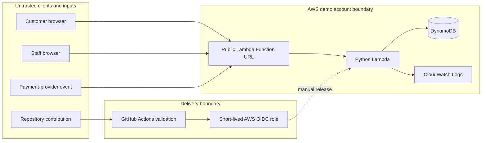

# Threat model

## Scope and assumptions

This model covers the zero-funding demonstration: its browser interfaces, Lambda Function URL, Python Lambda, six DynamoDB tables, CloudWatch logs, payment webhook boundary and GitHub-based delivery path. The separate non-production and production foundations are not running services and are outside the demo's runtime boundary.

The system uses synthetic data only. It must not collect payment-card details, identity documents or real operational secrets. HTTPS termination and the underlying AWS services are trusted cloud controls; customer devices, public requests, staff-entered credentials, provider events and repository contributions are untrusted inputs.

## Assets

| Asset | Why it matters | Protection objective |
|---|---|---|
| Booking contact and journey details | Personal and operational information | Confidentiality and bounded retention |
| Customer access tokens | Authorize customer status and quote actions | Never store or log plaintext |
| Staff credentials | Authorize operational changes | Strong hashes and server-side role checks |
| Payment webhook secret | Authenticates simulated provider events | Never commit or expose it |
| Booking, fleet, quote and payment state | Drives operational decisions | Transactional integrity and idempotency |
| Notification outbox | Records customer communication work | No lost or duplicate decisions |
| Terraform and release workflow | Defines cloud resources and promotion | Reviewable, least-privilege delivery |
| Logs | Support incident diagnosis | Useful correlation without sensitive values |

## Trust boundaries

Authentication at one boundary does not grant authority at another. A customer token cannot perform staff work, a staff password cannot forge provider webhooks, and a booking reference alone is not a credential.

## Abuse cases and controls

| Threat | Example attack or failure | Current control | Residual demo risk / production requirement |
|---|---|---|---|
| Spoofing | Guess a booking reference to read customer data | Separate high-entropy token, stored as SHA-256 only; constant-time comparison; indistinguishable not-found response | Replace possession tokens with managed customer identity for sensitive workflows |
| Spoofing | Impersonate staff | Salted PBKDF2 hashes with enforced work-factor and shape; role checks in the API | Shared role passwords lack MFA, user attribution, lockout and individual revocation |
| Spoofing | Forge a payment-provider callback | HMAC-SHA256 signature verified with constant-time comparison | Adopt provider-specific timestamp/replay rules and secret rotation before integration |
| Tampering | Partially assign a vehicle or apply only part of a payment | Conditional DynamoDB transactions update related records together | Add production backup, restore and reconciliation controls |
| Tampering | Replay booking or webhook requests | Request fingerprints, idempotency keys and immutable provider-event IDs | Retention windows bound replay memory; provider contract must define retry duration |
| Repudiation | Deny an operational action | Correlated structured logs include request ID, outcome and staff role | One-day logs and shared roles are not a durable audit trail |
| Information disclosure | Leak tokens or customer data through logs or staff lists | Tokens stored only as hashes; structured logs omit request bodies; staff responses remove private fields | No formal DLP; never use real identity or card data in the demo |
| Information disclosure | Publish secrets or state in the public repository | `.gitignore`, tracked-file secret scanning and blocked sensitive artifact types in CI | Pattern matching cannot find every secret; exposed credentials must still be rotated |
| Denial of service | Flood the public Function URL or expensive password verifier | 16 KB body limit, five-second Lambda timeout, concurrency one and minimum table capacity | No WAF or managed rate limiting; the demo may become unavailable under abuse |
| Cost exhaustion | Generate chargeable requests | Minimal capacity, restricted service allowlist, short logs, USD 1 actual and forecast alerts | Budgets do not cap spend; do not publicly deploy without current pricing and approval |
| Elevation of privilege | Operator changes fleet controls reserved for administrators | Server-side capability checks mirror dashboard restrictions | Move to individual managed identities and centrally governed roles for production |
| Supply-chain compromise | A mutable CI action changes after review | Third-party actions pinned to full commits and workflow permissions tested | Dependency review, provenance and environment approvals remain production work |

## Security invariants

The following conditions should fail automated tests if weakened:

1. Customer endpoints require both a canonical booking ID and the matching private token.
2. Staff-only routes resolve a valid role on the server; hidden browser controls are not authorization.
3. Provider events require a valid signature and cannot apply the same event twice.
4. Multi-record business changes are atomic and conditionally reject stale state.
5. Request bodies and identifiers are bounded before costly or state-changing work.
6. Logs do not include passwords, tokens, webhook secrets or request bodies.
7. Demo IAM grants no wildcard actions or resources.
8. CI publishes no Terraform state, real variable files, private keys or deployment packages.

## Risk acceptance and review triggers

The demo accepts low availability, shared staff credentials, short log retention and lack of an edge-security service because it is local-first, contains synthetic data and is not authorized for production. These are explicit limitations, not production recommendations.

Review this threat model whenever a change adds a public route, data category, AWS service, third-party integration, authentication mechanism, staff role or deployment permission. A real launch also requires privacy review, provider-specific payment analysis, abuse-rate assumptions, incident ownership, restore testing and an independent security assessment.
